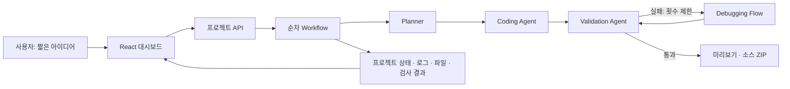

# AI Development Agent 설계

사용자는 짧은 아이디어와 결과물 유형만 입력한다. 시스템은 추가 질문 대신 기본 가정을 명시하고, 요구사항 분석부터 실행 검증까지의 진행 상태와 산출물을 보여 준다. 목표는 생성된 소스와 실행 가능한 MVP를 함께 전달하는 것이다.

## 실행 모드와 범위

`local` 모드는 정해진 규칙과 템플릿으로 계획과 코드를 생성한다. API 키 없이 전체 생성·실행·검증 흐름을 확인할 수 있지만, 임의의 요구사항을 이해하는 AI 모델은 아니다. 생성된 기능과 계획의 가정을 함께 확인해야 한다.

API 데이터의 `openai` 모드 값은 기존 계약을 유지한 AI 생성 모드 이름이며 현재 OpenAI Responses와 Gemini API 공급자를 지원한다. 실제 공급자는 연결의 `provider`와 모델 ID로 구분한다. 모델이 작성할 수 있는 파일은 허용된 브라우저 자산으로 제한하고, 인증·데이터 저장·서버 실행은 신뢰할 수 있는 템플릿이 담당한다. 모델이 만든 서버 코드나 설치 명령을 호스트에서 실행하지 않는다.

현재 MVP는 웹 앱·AI 에이전트·Android 모바일 앱을 대상으로 한다. 웹/에이전트는 신뢰된 로그인·사용자별 데이터·도구 실행 기반을 사용한다. 모바일은 로컬 저장소와 오프라인 화면을 Android WebView에 함께 넣으며 클라우드 로그인·동기화·푸시·결제를 제공하지 않는다. Launchpad 서비스의 Google 로그인과 생성된 앱의 로그인은 별도 계층이다.

생성 모드와 배포 위치는 별개다. 로컬 실행에서는 Node 프로세스와 `.data`를 사용하고, Vercel 배포에서는 Functions·private Blob·Sandbox를 사용한다. 두 배치 모두 API 키 유무에 따라 `local` 또는 `openai` 생성 모드를 선택한다. 배포와 환경 변수는 [Vercel 배포 문서](vercel.md)에 정리되어 있다.

## 구성



- **대시보드:** 요구사항 입력, 단계별 상태, 계획, 파일, 로그, 검사 결과와 실행 링크를 표시한다.
- **프로젝트 API:** 생성·조회·취소·재시도·실행·다운로드 요청을 처리한다.
- **Planner:** 기능, 대상 사용자, 기본 가정, 기술 스택과 파일 구조를 정한다.
- **Coding Agent:** 허용된 프로젝트 디렉터리에 신뢰된 서버 템플릿과 브라우저 코드를 생성한다.
- **Validation Agent:** 생성된 코드를 실제로 검사하고 인증 및 데이터 작업을 실행해 결과를 기록한다.
- **Debugging Flow:** 실패 로그를 근거로 수정하고 제한된 횟수만큼 다시 검사한다. 검증 실패를 성공으로 표시하지 않는다.
- **프로젝트 저장소:** 로컬은 `.data` 또는 `DATA_DIR`, Vercel은 private Blob에 메타데이터와 생성된 소스를 저장한다. 다운로드는 실행 시 생성된 사용자 데이터나 비밀을 포함하지 않는다.

구현 경계는 `src/`의 UI, `server/app.mjs`의 워크플로·API, `server/provider.mjs`의 모델 공급자와 출력 검사, `server/templates.mjs`의 템플릿, `server/processes.mjs`의 실행·검증, `src/types.ts`의 공통 API 데이터 형태로 나뉜다. Vercel 제어 계층은 `server/cloud/`, Functions 진입점은 `api/index.mjs`에 있다.

## 단계와 성공 조건

| 단계 ID | 역할 | 확인 가능한 결과 |
| --- | --- | --- |
| `requirements` | 짧은 입력을 해석하고 기본 가정을 정한다. | 계획의 요약·사용자·가정 |
| `features` | 핵심 기능과 추가 기능을 구분한다. | 기능별 설명과 우선순위 |
| `architecture` | 기술 스택과 파일 구성을 정한다. | 스택과 파일 트리 |
| `scaffold` | 실제 프로젝트 디렉터리를 만든다. | 생성된 프로젝트 파일 |
| `coding` | 실행 코드를 작성한다. | 열람·다운로드할 수 있는 소스 |
| `validation` | 문법과 실제 서버 동작을 검사한다. | 검사별 성공 여부와 설명 |
| `debugging` | 검사 실패를 수정하고 재검증한다. | 수정 로그와 재검사 결과; 처음부터 통과하면 생략 |
| `delivery` | 검사에 통과한 결과물을 전달한다. | 웹 실행 URL 또는 모바일 화면과 소스 ZIP; APK는 별도 빌드 작업 |

진행률은 실제 단계 상태에 따라 갱신한다. 기다리는 시간을 흉내 내는 애니메이션이나 사전 작성된 성공 로그를 검증 결과로 사용하지 않는다. 한 단계의 완료는 그 단계의 성공만 의미하며, 프로젝트 전체 성공은 최종 검증과 전달까지 끝났을 때만 성립한다.

## 데이터와 API 계약

`Project`는 최초 입력, 결과물 유형, 실행 모드, 단계 상태, 로그, 계획, 파일, 검사 결과, 미리보기 URL, 오류와 재시도 횟수를 보유한다. 각 검사는 `Check`의 `name`, `passed`, `detail`로 기록한다. 상세 타입은 `src/types.ts`, 엔드포인트 계약은 `CONTRACT.md`를 기준으로 한다.

| API | 용도 |
| --- | --- |
| `GET /api/config` | 현재 생성 모드와 모델·재시도 설정 확인 |
| `GET /api/credentials` | 현재 계정 또는 브라우저의 키 연결 출처·공급자·마스킹·모델·만료 확인 |
| `PUT /api/credentials` | `{ apiKey, model, provider }`를 암호화해 개인 연결 저장 |
| `DELETE /api/credentials` | 개인 키 제거 및 해당 실행 중단 |
| `GET /api/projects` | 저장된 프로젝트 목록 조회 |
| `POST /api/projects` | `{ prompt, kind }`로 비동기 생성 시작 |
| `GET /api/projects/:id` | 최신 상태와 산출물 조회 |
| `POST /api/projects/:id/cancel` | 진행 중 생성 취소 |
| `POST /api/projects/:id/retry` | 실패하거나 취소된 생성 재시도 |
| `POST /api/projects/:id/revise` | 완성된 소스와 수정 요청으로 별도 프로젝트 ID의 새 버전 생성 |
| `POST /api/estimate` | 규칙 기반 시간·토큰 범위와 등록 단가에 따른 API 비용 예상 |
| `GET /api/projects/:id/android` | 모바일 APK 빌드 상태 확인 |
| `POST /api/projects/:id/android/build` | 실제 Android APK 빌드 시작 |
| `GET /api/projects/:id/android/apk` | 완성된 개발용 APK 다운로드 |
| `GET /api/projects/:id/android/source` | Android Studio/Gradle 소스 ZIP 다운로드 |
| `POST /api/projects/:id/launch` | 생성된 앱을 별도 프로세스로 실행 |
| `GET /api/projects/:id/download` | 독립 실행용 소스 ZIP 다운로드 |
| `GET /api/projects/:id/events` | 프로젝트 상태의 SSE 구독 |

UI는 SSE 또는 폴링으로 최신 프로젝트를 읽을 수 있다. API 오류는 `{ error: string }`으로 반환한다.

`server/credentials.mjs`는 개인 키 암호화·12시간 만료와 로컬/private Blob 저장을 담당한다. `server/google-auth.mjs`가 검증한 계정 소유자를 우선 사용하고, Google 미설정 시 서명된 브라우저 식별자를 사용한다. 개인 키 프로젝트에는 `ownerId`, `credentialSource: 'personal'`을 기록한다. Google 로그인 사용자는 공용 키/로컬 모드에서도 새 프로젝트가 계정에 귀속된다. 실행마다 소유자의 연결을 해석하며 전역 환경 변수를 바꾸지 않는다. `CredentialStatus`는 원문 키를 반환하지 않으며 저장 시 `validated: false`다. 첫 모델 요청에서 실제 권한을 확인한다. 개인 연결 입력은 `{ apiKey, model, provider }`이며 공급자는 `openai` 또는 `gemini`다.

## 모바일·새 버전·견적 확장

`server/mobile-template.mjs`는 오프라인 자산을 생성하고, `server/android-builder.mjs`는 신뢰된 네이티브 WebView 셸에 자산을 넣어 SDK 도구로 컴파일·개발 서명한다. `server/mobile-builds.mjs`가 로컬 작업 큐 또는 인증된 외부 실행기를 선택한다. Vercel에서는 `server/cloud/android-worker.mjs`가 작업을 수행하고 APK를 private Blob에 저장한다. 파일 구조·SHA-256·프로젝트 소유권을 확인하며 실패한 빌드를 준비 완료로 표시하지 않는다. 화면 미리보기는 웹 UI 실행이며 Android OS 에뮬레이터가 아니다.

`server/revisions.mjs`는 완성된 프로젝트의 명세와 허용된 브라우저 파일만 새 작업에 전달한다. AI 연결은 변경 요청을 반영하고 로컬 모드는 복제한다. 원본·기존 사용자 데이터·계정·비밀은 이전하지 않으며 모바일 저장소는 새 프로젝트 ID를 사용한다.

`server/estimate.mjs`는 네트워크 호출 없이 시간·토큰 범위를 계산하고, 운영자가 등록한 정확한 모델 단가가 있을 때만 API 비용을 표시한다. 실측 정산, 구독 잔액 조회, 강제 예산 제한은 아니다. `ExamplesGallery`의 기획/화면은 명시된 체험 샘플이며 실제 생성 상태에 포함하지 않는다. 스토어 게시와 Stitch·v0·Figma 외부 디자인 서비스는 현재 연결되어 있지 않다. [상세 배포 설정](vercel.md), [스토어 확장](store-publishing.md), [디자인/견적](design-integrations.md)

## 확장 계약

확장은 생성 유형, 모델 공급자, 도구, 검증기를 서로 구분해서 추가한다. 아래는 확장을 위한 설계 기준이며, 임의의 플러그인을 자동으로 설치·실행하는 기능을 뜻하지 않는다.

**새 프로젝트 유형:** `server/templates.mjs`의 `registerTemplate(kind, { plan, generate })`로 등록한다. `plan(prompt, kind)`는 `Plan`을, `generate(project)`는 `GeneratedFile[]`을 반환한다. 둘 다 워크플로가 `await`하므로 비동기 구현도 가능하다. 다음은 기존 실행 기반을 재사용하는 최소 예다.

```js
registerTemplate('notes-app', {
  plan(prompt, kind) {
    return { ...localPlan(prompt, kind), name: '나의 메모 공간' };
  },
  generate: generateTemplate,
});
```

등록과 함께 `src/types.ts`의 `ProjectKind`, 입력·필터 UI, `server/cloud/handler.mjs`의 프로젝트 유형 허용 목록을 갱신한다. 현재 파일 작성과 ZIP은 `TEMPLATE_FILES`의 고정 소스 목록을 사용하며 모델이 변경할 파일도 `provider.mjs`에서 별도로 제한한다. 서버 파일이나 새로운 프레임워크를 추가하려면 이 계약과 실행·검증 구현을 함께 확장해야 한다. 새 템플릿이 결과물 단독 실행과 다운로드 후 실행까지 지원하는지 확인한다.

**새 모델 공급자:** `createApp({ provider })`에 `plan({ prompt, kind, signal })`, `code({ project, files, errors, signal })`을 갖는 공급자를 주입할 수 있다. `validatePlan`과 `validateAssets`가 계획과 브라우저 파일 출력을 검사한다. 수정 단계는 같은 `code()`에 실패 검사 목록을 전달한다. 현재 OpenAI/Gemini 선택은 개인 연결 또는 `AI_PROVIDER`에서 정하며 클라우드 worker도 해당 공급자를 전달받는다. 추가 공급자는 키 계약·worker 전달·UI 선택을 함께 확장한다. 공급자 실패를 로컬 모드로 몰래 바꾸지 않는다.

**새 도구:** 현재 도구는 `server/templates/runtime.mjs`의 `runAgent()`에서 `analyze`, `checklist`, `ai`를 처리한다. 새 도구를 추가할 때는 이 함수의 입력 검사와 실행 분기, `server/templates.mjs`의 도구 선택 UI, 모델 코드 생성 지침, 실행 검사를 함께 수정한다. 도구를 동적으로 발견·설치하는 레지스트리는 아직 없다. 도구 이름, 입력·출력 스키마, 필요한 비밀, 네트워크 범위와 부작용을 명시하고 서버가 허용한 기능만 실행한다.

**새 검증기:** `server/processes.mjs`의 `validateProject()`에 검사를 추가하고 실제 결과를 `Check[]`로 반환한다. 실패 메시지는 수정 단계가 활용할 수 있도록 작성한다. 문법 검사를 추가하는 것과 기능 요구사항을 검증하는 것은 구분한다. 외부 연동 기능은 모의 응답 검사와 실제 서비스 검사를 별도로 표시한다.

## 실행과 보안 경계

로컬 개발 제어 서버는 기본적으로 `127.0.0.1:3001`에서 실행하고, 생성된 웹 앱은 별도 루프백 포트를 사용한다. 생성된 앱의 로그인은 결과물의 기능이며 제어 서버의 접근 제어를 대신하지 않는다. Vercel에서는 Google 로그인 또는 공용 비밀번호를 적용하고 생성 웹 앱은 프로젝트별 Sandbox와 임시 접근 토큰을 사용한다. 모바일 APK는 임시 서버 URL에 의존하지 않는 번들 자산을 실행한다.

모델 출력은 신뢰되지 않은 입력으로 취급한다. 허용 경로 밖의 파일, 임의의 서버 실행 코드, 셸 명령 또는 의존성 설치를 모델 응답에서 그대로 실행하지 않는다. 생성 과정과 미리보기 프로세스의 수명 주기를 관리하고, 취소·실패·종료 시 관련 자원을 정리해야 한다.

다른 포트의 웹 페이지도 같은 컴퓨터에 접근할 수 있으므로 제어 API는 교차 출처 요청을 제한한다. 생성된 앱에 제어 서버의 세션을 전달하지 않고 출처·쿠키 경계를 유지한다. API 키는 서버 환경 변수 또는 서버의 암호화된 개인 연결로 관리하며 소스 ZIP과 브라우저 코드에 포함하지 않는다.

루프백 서버와 허용된 서버 템플릿은 로컬 MVP의 위험을 줄이는 방법이다. 완전한 운영용 격리 환경은 아니며, 여러 사용자의 임의 프로젝트를 공개적으로 실행하는 서비스에는 아래 추가 작업이 필요하다.

## 운영 서비스로 발전시키는 순서

1. **실행 격리 강화:** Vercel 배치에서는 프로젝트별 Sandbox를 사용한다. 운영 요구에 맞게 CPU·메모리·실행 시간·네트워크와 파일 시스템 권한을 구체화한다. 로컬 배치는 신뢰된 서버 템플릿을 실행하는 현재 범위를 유지한다.
2. **서비스 사용자와 데이터 분리:** 구현된 Google 로그인·소유권에 운영용 역할/공유 권한, 테넌트별 영속 저장소와 감사 로그를 추가한다.
3. **영속 작업 처리:** 작업 큐와 워커를 분리하고 프로세스 재시작 후 복구, 동시 실행 한도, 취소 전파와 중복 실행 방지를 구현한다.
4. **요구사항 검증 확대:** 생성된 기능 명세에서 사용자 시나리오를 도출해 브라우저 통합 검사와 회귀 검사를 실행한다. 현재의 기본 인증·CRUD 검사가 모든 요구사항의 완성을 보장하지는 않는다.
5. **확장 레지스트리:** 현재의 템플릿 등록과 공급자 주입 계약을 바탕으로 도구·검증기 등록 방식을 추가하고 버전 및 호환성을 관리한다.
6. **배포와 운영:** 비밀 저장소, 외부 인증, 배포 대상, 모니터링, 사용량·비용 제한, 백업과 삭제 정책을 연결한다.

이 구조에서 사용자가 확인하는 핵심은 “AI가 작업 중”이라는 표시 자체가 아니라 어떤 가정으로 무엇을 생성했고, 무엇을 실제로 검사했으며, 어떤 결과물이 실행되는지다.
