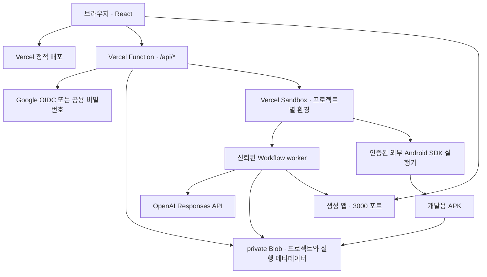

# Vercel 배포

Launchpad의 화면과 제어 API는 Vercel에 배포하고, 앱 생성·코드 검사·웹 미리보기 실행은 Vercel Sandbox에서 수행한다. 프로젝트 상태와 소스는 private Vercel Blob에 저장한다. **Android APK 생성에는 SDK를 갖춘 별도 빌드 실행기**를 추가로 연결한다. Vercel 정적 배포만으로 APK나 스토어 게시까지 완료되는 구조는 아니다.

이 저장소에는 Google 로그인, 개인 OpenAI 키, Sandbox·Blob 및 원격 APK 실행기의 연동 코드가 포함되어 있다. 실제 Vercel 배포, 운영 Google OAuth, 실제 모델 API 호출과 원격 빌드 서버 연결은 자격 증명을 설정한 뒤 별도로 검증해야 한다. 로컬 APK 컴파일·설치·실행은 확인한 범위다. Codex 구독 생성은 개인 컴퓨터에서만 실행하며 Vercel로 로그인 정보를 전달하지 않는다.

## 준비

1. 저장소를 Vercel 프로젝트로 가져온다. 빌드는 `npm run build`, 출력 디렉터리는 `dist`이며 `vercel.json`에 설정되어 있다. Node.js 22 이상을 선택한다.
2. 같은 프로젝트에 **private Blob 저장소**를 연결한다. `BLOB_READ_WRITE_TOKEN`이 실행 환경에 등록되어야 한다. 공개 저장소를 사용하지 않는다.
3. 프로젝트에서 Vercel Sandbox를 사용할 수 있는지 확인한다. 배포된 Functions에서는 SDK가 Vercel OIDC 인증을 사용한다. 계정 권한, 사용량 한도와 프로젝트 설정이 적용된다.
4. 아래 환경 변수를 Production과 필요한 Preview 환경에 등록한 뒤 배포한다. 비밀은 Vercel 환경 변수로 입력하고 소스나 브라우저 코드에 넣지 않는다.
5. Google 웹 OAuth 클라이언트와 배포 도메인의 콜백을 등록한다. Google 로그인을 사용하지 않는 환경은 공용 워크스페이스 비밀번호를 구성한다. 두 설정이 모두 유효하면 **Google 로그인이 우선**하며 비밀번호 로그인은 사용하지 않는다.
6. 배포 URL에서 로그인하고 필요하면 설정에서 개인 OpenAI API 키를 연결한다. 웹/에이전트의 실제 실행, 모바일 화면과 APK 다운로드, 소스 ZIP의 독립 실행을 각각 확인한다.

| 변수 | 필요 여부 | 의미 |
| --- | --- | --- |
| `GOOGLE_CLIENT_ID`, `GOOGLE_CLIENT_SECRET` | Google 로그인 사용 시 | Google Cloud에서 만든 웹 애플리케이션 OAuth 클라이언트 |
| `PUBLIC_APP_URL` | Google 로그인 사용 시 | 고정된 배포 origin. 예: `https://your-app.vercel.app`; 경로·쿼리·해시 제외 |
| `GOOGLE_ALLOWED_EMAILS` | 선택 | 로그인 허용 이메일을 쉼표로 구분. 미설정 시 인증된 Google 계정을 허용 |
| `WORKSPACE_PASSWORD` | Google 로그인 미설정 시 | 공용 비밀번호. 최소 12자. Google 로그인과 둘 중 하나는 유효하게 구성해야 함 |
| `SESSION_SECRET` | 필수 | 로그인·개인 브라우저 식별 서명과 개인 API 키 암호화용 비밀. 최소 32자 |
| `BLOB_READ_WRITE_TOKEN` | 필수 | 연결한 private Blob 저장소의 서버 토큰 |
| `OPENAI_API_KEY` | 선택 | 개인 키를 연결하지 않은 사용자가 사용할 공용 서버 API 키 |
| `OPENAI_MODEL` | 선택 | 기본값 `gpt-4.1-mini`; 해당 API 계정이 사용할 수 있는 모델 ID |
| `AI_PROVIDER` | 선택 | Vercel에서는 `openai` 또는 미설정만 허용. `codex` 구독 실행은 로컬 전용이며 배포 시 거절 |
| `ANDROID_BUILDER_URL` | 원격 APK 빌드 시 | SDK 실행기의 HTTPS origin. `/build` 경로는 코드가 붙임 |
| `ANDROID_BUILDER_TOKEN` | 원격 APK 빌드 시 | 실행기와 공유하는 32자 이상의 비밀 토큰 |
| `ESTIMATE_MODEL_RATES_JSON` | 비용 견적 표시 시 | 정확한 `공급자/모델`별 입력·출력 100만 토큰당 USD 단가. 아래 형식 참고 |
| `MAX_RETRIES` | 선택 | 자동 수정 횟수, 기본 2, 지원 범위 0~3 |
| `MAX_CONCURRENT_PROJECTS` | 선택 | 동시에 생성하는 프로젝트 수, 기본 3, 지원 범위 1~10 |
| `SANDBOX_TIMEOUT_MS` | 선택 | 미리보기 세션 실행 시간. 기본 1,800,000ms(30분), 코드 지원 범위 5~45분. 계정 한도도 적용 |
| `VERCEL_TOKEN`, `VERCEL_TEAM_ID`, `VERCEL_PROJECT_ID` | OIDC 대신 사용할 때만 | 세 변수를 함께 지정하면 Sandbox SDK의 명시적 인증에 사용 |

공용 OpenAI 키와 개인 키가 모두 없으면 로컬 템플릿 모드가 **Sandbox 안에서** 실행된다. 개인 키는 설정에서 모델과 함께 등록하며 공용 키보다 우선한다. API 사용료는 해당 OpenAI API 계정에 청구된다. Google 로그인과 ChatGPT 구독은 이 API 결제와 별개다. `CODEX_HOME`, Codex 로그인 파일·토큰 및 `CODEX_CLI_PATH`를 Vercel에 복사하지 않는다. [로컬 구독과 원격 배포 구분](openai-subscription.md)

워크스페이스 비밀번호와 세션 비밀은 각각 별도로 생성한다. 예를 들어 로컬 터미널에서 `node -e "console.log(require('node:crypto').randomBytes(32).toString('hex'))"`를 두 번 실행해 다른 값을 사용할 수 있다.

## Google 로그인 등록

Google Cloud Console의 OAuth 동의 화면과 웹 클라이언트를 만들고 승인된 리디렉션 URI에 `https://your-app.vercel.app/api/auth/google/callback`을 정확히 등록한다. 이 origin과 `PUBLIC_APP_URL`이 같아야 한다. OAuth 앱이 테스트 상태라면 Google 콘솔에도 테스트 계정을 등록한다. Vercel Preview는 운영 도메인의 쿠키·콜백을 공유한다고 가정하지 말고 별도의 고정 도메인과 설정으로 검증한다.

서버는 인증 코드, PKCE·state·nonce와 Google JWKS 서명을 검증한 뒤 12시간의 HttpOnly 애플리케이션 세션을 발급한다. Google access/refresh/ID 토큰을 보관하거나 모델 호출에 재사용하지 않는다. 상세 설정과 검증 항목은 [Google 로그인](google-login.md)에 있다.

## 배포 구조

- `api/index.mjs`: Functions 진입점.
- `server/cloud/handler.mjs`: 기존 프로젝트 API 계약에 맞는 클라우드 제어 기능.
- `server/cloud/auth.mjs`: HttpOnly·Secure·SameSite 세션과 비밀번호 검증.
- `server/google-auth.mjs`: Google OIDC와 계정 소유자 식별.
- `server/cloud/store.mjs`: private Blob 읽기·쓰기, ETag 조건부 갱신, 동시 생성 슬롯.
- `server/cloud/sandbox.mjs`: 신뢰된 서버 파일 복사, 의존성 설치, worker 시작·정지·미리보기 재실행.
- `server/cloud/worker.mjs`: 기존 `createApp()` 워크플로를 Sandbox에서 실행하고 실제 단계 결과를 Blob에 게시.
- `server/cloud/android-worker.mjs`: 외부 APK 실행기를 호출하고 완성된 APK를 private Blob에 저장.
- `server/android-service.mjs`: SDK가 설치된 별도 호스트에서 실행하는 인증된 빌드 서비스.

생성 요청은 Sandbox 준비와 worker 시작이 확인된 후 HTTP 202를 반환한다. 이후 작업은 Sandbox의 분리된 프로세스에서 계속되며, UI는 Blob에 저장된 최신 상태를 폴링한다. 장시간 생성 작업이 Functions 요청의 실행 수명에 의존하지 않도록 나눈 구조다. 첫 실행에는 신뢰된 의존성 설치 시간이 추가된다.

## Android 실행기 연결

SDK 호스트에 JDK 17 이상, Android SDK Platform 34 및 Build Tools 34 이상을 설치하고 `JAVA_HOME`, `ANDROID_HOME`을 설정한다. 현재 산출물은 오프라인 WebView 기반 개발용 APK다. 도구 자동 탐색과 Gradle 소스 내보내기는 [Android 빌드](android-build.md)를 따른다.

호스트에서 32자 이상 `ANDROID_BUILDER_TOKEN`을 설정한 뒤 `node --env-file-if-exists=.env server/android-service.mjs`를 실행한다. 기본 바인딩은 `127.0.0.1:3002`다. 필요하면 `ANDROID_BUILDER_HOST`, `ANDROID_BUILDER_PORT`, `ANDROID_BUILD_DATA`를 실행기 환경에만 지정한다. 인증된 HTTPS 프록시 뒤에 노출하고 Vercel에는 해당 origin과 같은 토큰을 등록한다. `GET /health`도 Bearer 토큰이 필요하며 `{ available: true }`인지 확인한다. 경로 접두사를 사용한다면 프록시가 루트 `/build`와 `/health`를 제공해야 한다.

완성된 모바일 프로젝트에서 `POST /api/projects/:id/android/build`를 호출하면 Sandbox의 분리된 worker가 실행기로 허용된 `public/` 자산만 전달한다. 실행기는 실제 컴파일·개발 서명·서명 검사를 수행한다. 수신 측은 APK 구조와 응답의 SHA-256을 확인하고 비공개 Blob에 저장한다. 다운로드 API도 프로젝트 소유권과 SHA-256을 확인한다. 원격 수신 측이 별도로 서명을 다시 검증하는 것은 아니므로 인증된 실행기를 신뢰 경계로 관리한다.

`GET /api/projects/:id/android`로 상태를 조회하고, `ready` 이후 `GET /api/projects/:id/android/apk`로 받는다. Android 소스는 `GET /api/projects/:id/android/source`다. 원격 요청은 4분·40MB 제한, 클라우드 상태는 5분을 넘는 빌드를 실패로 처리한다. 실행기 미연결·도구 미설치·실패 상태를 APK 준비 완료로 표시하지 않는다. 기본 SDK 서비스는 한 번에 한 APK를 빌드하며 대규모 작업 큐는 추가 구현 대상이다.

APK 다운로드와 Google Play/App Store 출시는 별개다. 릴리스 AAB·서명·개발자 계정·심사 제출과 iOS 빌드는 아직 연결되지 않았다. [스토어 배포 확장 설계](store-publishing.md)

## 견적과 새 버전 생성

`POST /api/estimate`는 `{ prompt, kind, agentDelivery? }`를 받아 현재 연결 모델과 재시도 설정에 맞춘 시간·토큰의 **규칙 기반 예상 범위**를 반환한다. `agentDelivery`는 AI 에이전트의 `web`, `api`, `mcp` 출력 방식이며 기본값은 `web`이다. 외부 API 호출이나 실제 잔액 조회를 수행하지 않는다. 비용은 `ESTIMATE_MODEL_RATES_JSON`에 정확히 일치하는 OpenAI 모델 단가가 있을 때만 산정한다.

단가 객체 형식은 `{"openai/모델ID":{"inputUsdPerMillion":입력단가,"outputUsdPerMillion":출력단가}}`다. 숫자는 운영자가 확인한 100만 토큰당 USD 단가여야 한다. 코드에 기본 서비스 가격은 없으며 미등록/잘못된 단가는 “미산정”으로 처리한다. Vercel·APK 실행기·저장/전송·구독·외부 디자인·스토어 비용은 제외한다. 표시한 최대값은 예산 상한이 아니며 지출 차단·사용량 정산은 아직 구현하지 않았다.

완성된 프로젝트는 `POST /api/projects/:id/revise`에 `{ prompt }`를 보내 **별도 프로젝트 ID의 새 버전**을 만든다. AI 연결 시 이전 명세와 HTML/CSS/JavaScript를 바탕으로 수정하고, 로컬 모드는 이전 화면을 복제한다. 원본을 덮어쓰지 않으며 기존 앱의 계정·사용자 데이터·API 키를 복사하지 않는다. 모바일 로컬 저장소도 새 프로젝트 ID로 구분한다. 소유권 검사를 유지하고 새 생성 작업의 모델 사용량이 발생할 수 있다.

기획·결과물 갤러리는 미리 준비한 체험 샘플이다. Stitch·v0·Figma 같은 외부 디자인 서비스의 호출·구독 연결은 아직 없다. [디자인 서비스와 견적](design-integrations.md)

## 재시도, 취소와 만료

각 시도에는 별도 `runId`가 있다. 상태 갱신은 Blob ETag 조건부 쓰기로 수행하며, 이전 시도의 worker가 새 시도나 취소된 상태를 덮어쓰지 못하게 한다. 동시 생성 슬롯 역시 조건부 쓰기로 예약한다.

취소 요청은 취소 상태를 저장하고 관련 Sandbox를 정지한다. 재시도는 같은 프로젝트 ID에 새 Sandbox를 할당한다. 실패 또는 취소된 프로젝트의 환경은 상태 조회 때도 정지를 시도한다.

기본 세션은 Sandbox를 만든 시점부터 30분 후 종료된다. 준비와 생성 시간도 이 수명에 포함된다. 생성 도중 시간이 끝나면 다음 상태 조회에서 실패로 표시한다. 이미 완료된 프로젝트는 완료 상태와 소스를 유지하고 만료된 미리보기 링크만 초기화한다. **앱 실행**을 다시 누르면 보존된 Sandbox를 재개하고 생성 앱 서버를 시작한다. 동시 재실행 요청은 실행 잠금으로 중복 worker를 만들지 않도록 처리한다.

Sandbox는 영속 모드와 최근 스냅샷 하나를 사용한다. 코드의 프로젝트 상태·소스 저장소는 Blob이고, 생성 앱의 계정·기록 데이터는 Sandbox 파일 시스템이다. Sandbox 자체나 그 스냅샷을 삭제하면 실행 데이터는 복원되지 않을 수 있다. 운영 서비스의 사용자 데이터는 별도 데이터베이스로 옮겨야 한다.

## 접근과 비밀

Google 로그인 환경에서는 검증된 계정의 고정 `sub`로 소유자를 식별한다. 새 프로젝트와 개인 키는 해당 계정에 귀속되므로 같은 계정으로 다른 브라우저에서 접근할 수 있다. Google 미설정 환경에서는 공용 비밀번호로 진입하며 공용 키·템플릿 프로젝트는 공유된다. 그 환경에서 개인 키 프로젝트는 서명된 브라우저 식별자에 귀속되므로 쿠키 삭제 후 복구·기기 간 동기화를 제공하지 않는다. 기존 소유자 없는 프로젝트는 공유 상태이고, 브라우저 소유 프로젝트를 Google 계정으로 자동 이전하는 기능은 없다.

설정에서 입력한 개인 키는 AES-256-GCM으로 암호화하여 private Blob의 별도 credentials 경로에 저장한다. 사용 유효기간은 12시간이며, 해제 시 암호화 값을 제거하고 연결 교체·해제 시 관련 실행을 종료한다. 저장 응답은 마스킹된 키와 `validated: false`를 반환하며 실제 모델 요청 전에는 유효성을 확인했다고 표시하지 않는다. 개인 키를 쓰던 AI 프로젝트는 만료 후 재연결을 요구하고 공용 키로 대체하지 않는다. `SESSION_SECRET`을 교체하면 세션·암호화 연결이 무효가 된다. Google 계정 소유 ID는 재로그인 후 유지되지만 브라우저 식별에 의존하던 프로젝트는 복구 정책이 필요하다. 만료된 Blob 암호문의 자동 삭제 작업은 별도 구성이다.

웹사이트용 **Sign in with ChatGPT plan usage**는 현재 구현하지 않았다. 공식 공개 문서는 오픈소스·로컬 앱의 흐름을 설명하고 원격·유료 앱은 별도 접근 신청으로 안내한다. 일반 Google 로그인이나 개인 컴퓨터의 Codex 로그인으로 Vercel 앱의 사용 자격이 자동으로 생기지 않는다. 접근 권한과 지원 범위를 확인한 후 사용자별 동의·OAuth·토큰 갱신·스트리밍 어댑터를 구현해야 한다. [공식 OpenAI 연결 범위](https://developers.openai.com/siwc/token-sharing-open-source), [현재 preview 제한](https://developers.openai.com/siwc/token-sharing-open-source/preview-limitations)

프로젝트 소스와 실행 메타데이터는 비공개 Blob으로 읽고 쓴다. 공개 Blob URL을 UI에 반환하지 않는다. API가 브라우저에 반환하는 `Project`에는 Blob 토큰, 모델 API 키, Google 클라이언트 비밀, APK 실행기 토큰과 Sandbox 관리 자격 증명이 포함되지 않는다.

미리보기 URL에는 임시 접근 토큰이 포함된다. 생성 앱은 이를 HttpOnly 접근 쿠키로 교환한 뒤 토큰 없는 주소로 이동한다. 접근 쿠키는 서로 다른 워크스페이스·Sandbox 사이트 사이의 최상위 링크 이동을 위해 `SameSite=Lax`를 사용하고, 앱의 로그인 세션은 `SameSite=Strict`를 유지한다. 따라서 아무나 Sandbox 도메인을 열어 가입하거나 소유자의 AI 키를 사용하는 일을 막는다. 미리보기 링크를 전달받은 사람은 해당 미리보기에 접근할 수 있으므로 공유 범위를 직접 관리한다. 앱 자체의 회원가입·로그인은 이 접근 게이트 뒤에서 별도로 동작한다.

모델은 허용된 브라우저 파일만 작성한다. worker와 Node 서버는 저장소의 신뢰된 코드로 실행하며, 브라우저 파일이 서버 비밀이나 Blob 저장소를 직접 읽을 수 있도록 연결하지 않는다. ZIP은 허용된 소스 파일만 포함하고 실행 데이터·세션·환경 변수는 제외한다.

## 확인과 운영 범위

배포 후 Google 로그인/허용 계정 제한, 개인 공급자·모델 연결, 프로젝트 소유권, 생성·취소·재시도, 새 버전 생성, 웹 앱 계정·기록, ZIP 실행과 만료 후 미리보기 재실행을 확인한다. 모바일은 화면 체험과 APK 실제 컴파일·다운로드·설치·데이터 유지를 별도로 확인한다. 견적 미등록 모델이 무료로 표시되지 않는지도 확인한다.

로컬 통합 테스트와 SDK를 대체한 클라우드 테스트는 코드 계약을 검증한다. 실제 Vercel 권한, Functions 시간 한도, Sandbox 이미지·네트워크, Blob 읽기·쓰기, 선택한 모델 사용 권한은 실제 배포에서 확인해야 한다. Cloud 실패는 저장된 프로젝트 상태와 Vercel Function/Sandbox 로그에서 확인한다.

기본 생성 제한은 소규모 사용을 위한 것이다. 계정별 소유권은 구현되어 있지만 운영용 역할·공유 권한, 요청 제한, 사용자별 실제 비용 한도, 영속 DB, 목록 페이지네이션, 작업·아티팩트 정리와 관측 기능은 추가 대상이다. 공용 비밀번호 로그인에는 별도 시도 횟수 제한이 없으므로 사용하는 경우 `/api/auth/login` 요청 제한을 구성한다. Sandbox·Blob·모델 API·외부 APK 호스트는 각각의 사용량 및 요금 체계가 적용된다.

공식 참고: [Sandbox SDK](https://vercel.com/docs/sandbox/sdk-reference), [Sandbox 인증](https://vercel.com/docs/sandbox/concepts/authentication), [Blob SDK](https://vercel.com/docs/vercel-blob/using-blob-sdk), [Node.js Functions](https://vercel.com/docs/functions/runtimes/node-js).
